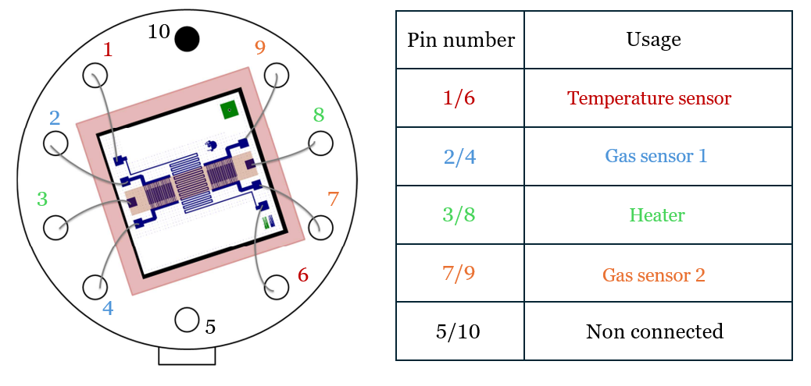
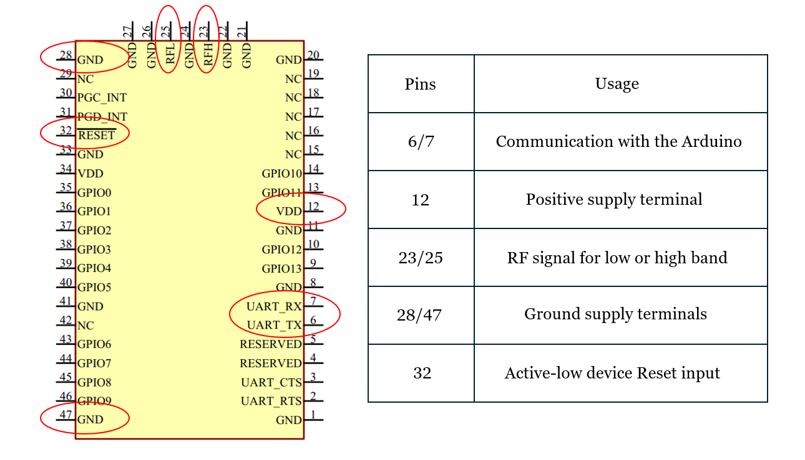
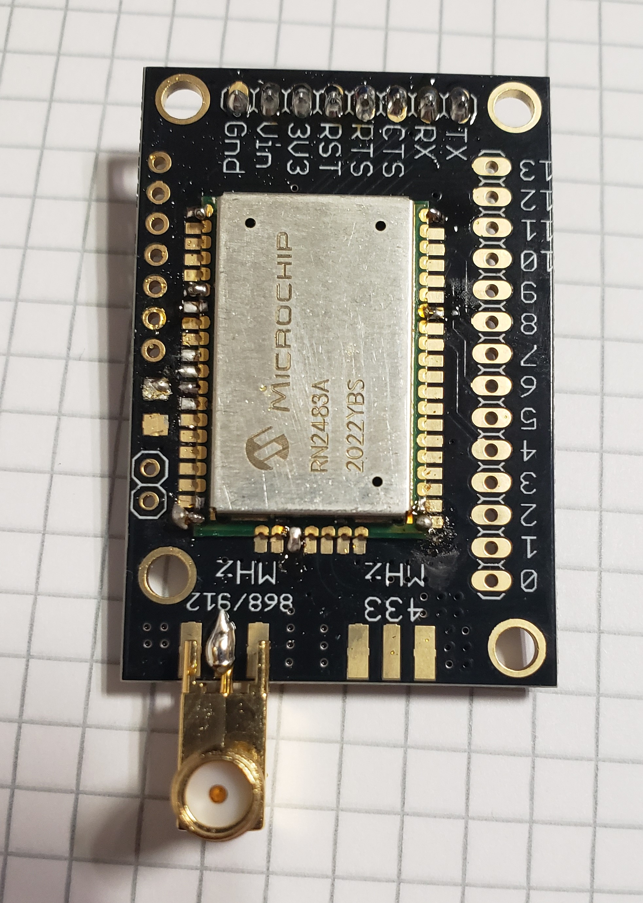
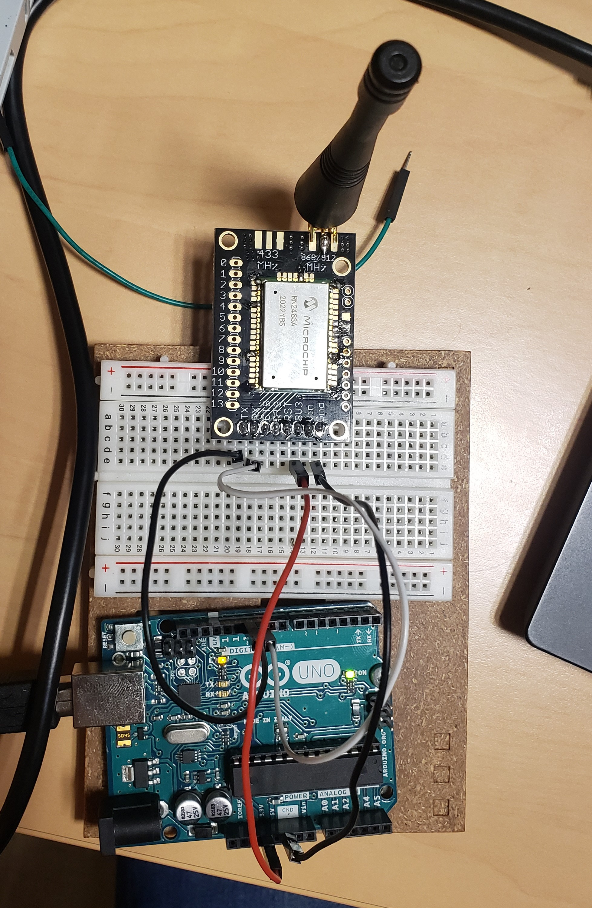
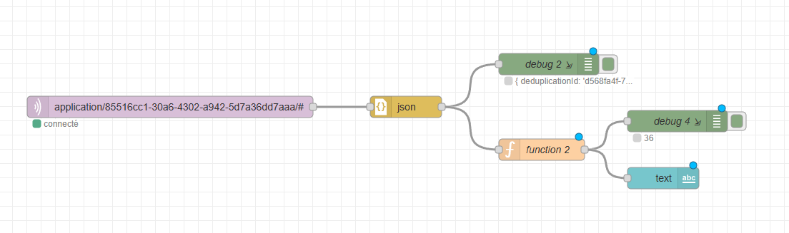

# Microcontrollers & Open Source Hardware (M&OSH)
This repository contains all the work and related documents realised by Rémi and David as part of the "Microcontroller & Open Source Hardware" major.  
Here is what you can find in this file :
* Course objectives
* Project description
* Technical realisation
* Delivery
* Improvements
* Conclusion
  

## Course objectives
The main objective of this class is to provide a transversal perspective of the creation of an IoT system. From the solution proposal to the end of system design, we take a look at all the conception steps, trying to merge both the hardware and software requirements.

## Project desciption
This project is a multidisciplinary work built around the use of a gas sensor. The idea is the following : we conceived a gas sensor to monitor air quality, and now want to integrate it in on an electronic card to collect data from its environment, then send them over a low speed network. As it is multidisciplinary, we divided the project in various steps : 
* Gas sensor conception
* Data communication via LoRa
* Hardware & PCB design

## Technical realisation
Let's look at the different steps of the project through the technical realisation point of view.

### Gas sensor conception
The gas sensor designed for monitoring air quality is composed of two sensing elements. Both are based on a combinaison of silicon substrate with tungsten trioxide nanoparticles, and allow to detect gas concentration regarding the variation of their conductivity. The sensor also integrate a temperature sensor, and only need a few mA to work.   

The sensor parts are described in the following schema :  

The gas sensor was conceived in AIME in october, but we will use a commercial sensor in the next steps of the project for simplicity reasons. 

### Data communication via LoRa
Now we have a working sensor, we want to be able to send the retrieved data. To do so, we will use LoRa protocol and the gateway accessible at INSA via ChirpStack.
In order to achieve the communication, we need a few elements :
* Electonical card (Arduino UNO)
* LoRa communication module (RN2483), plugged to the UNO
* Gas sensor (MQ2), plugged to the UNO
  
First, we use the RN2483 datasheet and choose the pins to use to connect it to the Arduino UNO :

The chosen pins are welded, then the module is connected to the arduino using wires and a breadboard :

   

To send data using LoRa from the INSA, we have to use a gateway accessible through ChirpStack framework. We reuse an already existing Arduino code modified as follow :
* Connect to the gateway using our specific credentials
* Retrieve data measured by the gas sensor
* Encode data from the sensor as bytes
* Use 'TheThingsNetwork' library, that allows to send data to ChirpStack gateway as bytes

You can find the Arduino code [here](https://github.com/patatorfr/5ISS-Goalard-Lacoste/blob/main/Capteur_Gaz/Capteur_Gaz.ino).

Now the data from the gas sensor can be send out using the gateway, the last step is to make the emitted data accessible. To do it, we use Node-RED and retrieve the data sent from ChirpStack as MQTT packets. We therefore use a function to decode the received data, as ChirpStack send them using base 64, and post a text of the final value : 

To test our system, we displayed the value measured by the sensor in the Arduino IDE, and displayed the same value after getting it on Node-RED. We fortunately displayed twice the same value.

#### 
