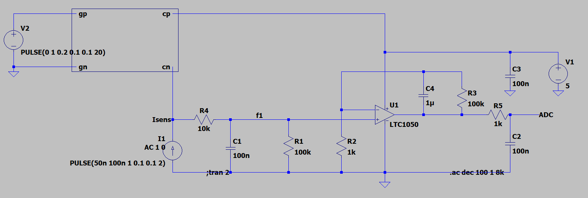
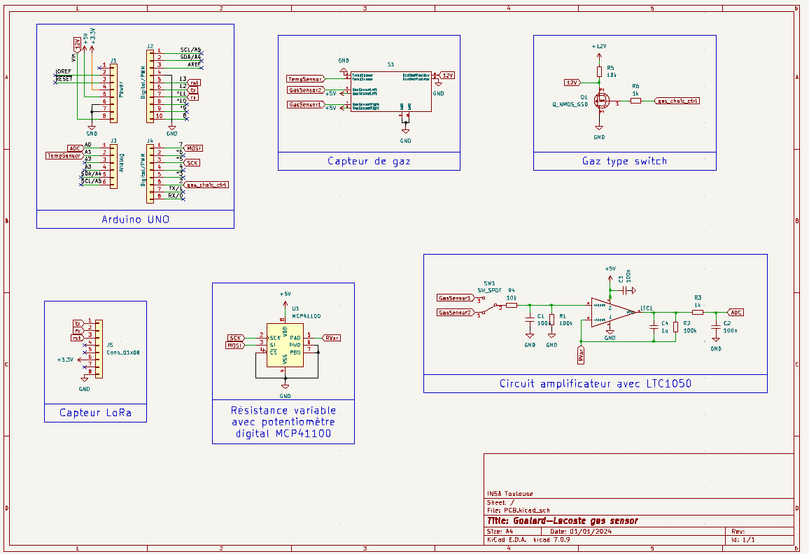

# Microcontrollers & Open Source Hardware (M&OSH)
This repository contains all the work and related documents realised by Rémi and David as part of the "Microcontroller & Open Source Hardware" major.  
Here is what you can find in this file :
* Course objectives
* Project description
* Technical realisation
* Delivery
* Improvements
* Conclusion
  
## Course objectives
The main objective of this class is to provide a transversal perspective of the creation of an IoT system. From the solution proposal to the end of system design, we take a look at all the conception steps, trying to merge both the hardware and software requirements.

## Project desciption
This project is a multidisciplinary work built around the use of a gas sensor. The idea is the following : we conceived a gas sensor to monitor air quality, and now want to integrate it in on an electronic card (Arduino) to collect data from its environment, then send them over a low speed network. As it is multidisciplinary, we divided the project in various steps : 
* Gas sensor conception
* Data communication via LoRa
* Hardware & PCB design

## Technical realisation
Let's look at the different steps of the project through the technical realisation point of view.

### Gas sensor conception
The gas sensor designed for monitoring air quality is composed of two sensing elements. Both are based on a combinaison of silicon substrate with tungsten trioxide nanoparticles, and allow to detect gas concentration regarding the variation of their conductivity. The sensor also integrate a temperature sensor, and only need a few mA to work.   

The sensor parts are described in the following schema :  

The gas sensor was conceived in AIME in october, but we will use a commercial sensor in the next steps of the project for simplicity reasons. As the sensor resistance is huge, and it varies depending on the gas it measures and its concentration, the input current of the Arduino will be very low. To make it usable, we need to increase the current value, which will be done using an amplifier circuit.

 It is composed as follow :
 
* Low-pass filter for input current noise : R4 - C1
* Actif filter to reduce 50Hz noise : R3 - C4
* Output low-pass filter : R5 - C2
* Gas sensor : we create a component that represent it with the relation => I=V(cp,cn)*(10n+v(gc,gn)*10n)).

We use LTSpice to simulate the behavior of the system and find the cutoff frequency of each filter :

| Filter | Frequency |
|----------|----------|
| 1, CHANGER | 16 Hz |
| 2, CHANGER | 1.6 Hz |
| 3, CHANGER | 1.6 kHz |

### Data communication via LoRa
Now we have a working sensor, we want to be able to send the retrieved data. To do so, we will use LoRa protocol and the gateway accessible at INSA via ChirpStack.
In order to achieve the communication, we need a few elements :
* Electonical card (Arduino UNO)
* LoRa communication module (RN2483), plugged to the UNO
* Gas sensor (MQ2), plugged to the UNO
  
First, we use the RN2483 datasheet and choose the pins to use to connect it to the Arduino UNO :

The chosen pins are welded, then the module is connected to the arduino using wires and a breadboard :

   

To send data using LoRa from the INSA, we have to use a gateway accessible through ChirpStack framework. We reuse an already existing Arduino code modified as follow :
* Connect to the gateway using our specific credentials
* Retrieve data measured by the gas sensor
* Encode data from the sensor as bytes
* Use 'TheThingsNetwork' library, that allows to send data to ChirpStack gateway as bytes

You can find the Arduino code [here](https://github.com/patatorfr/5ISS-Goalard-Lacoste/blob/main/Capteur_Gaz/Capteur_Gaz.ino).

Now the data from the gas sensor can be send out using the gateway, the last step is to make the emitted data accessible. To do it, we use Node-RED and retrieve the data sent from ChirpStack as MQTT packets. We therefore use a function to decode the received data, as ChirpStack send them using base 64, and post a text of the final value : 

To test our system, we displayed the value measured by the sensor in the Arduino IDE, and displayed the same value after getting it on Node-RED. We fortunately displayed twice the same value.

### Hardware & PCB design
In the previous part, we used a breadboard to connect the sensor to the Arduino. This is not an optimal solution, so we use KiCad to design a shield that can be directly plugged on the Arduino board.  

First, let's have a look at the various components of the shield :   

* Arduino UNO board :   
  Generic board provided by KiCad.
  
* Gas sensor :    
  We created a symbol for our manufactured gas sensor, using the 'Package_TO_SOT_THT:TO-5-10_Window' footprint.
  
* Gas type switch :     
  As the gas sensor is capable of measuring 2 different gases, we use a switch to choose the one we want the informations from. It is composed of 2 resistors and a MOSFET transistor. The choice of the gas measured is done via the GPIO n°2 of the Arduino UNO.
     
* LoRa connector :   
  We welded the LoRa module on a little PCB to have a better view/use of its pins. Therefore we just have to plug it on a connector to access the LoRa chip.
  
* Amplifier circuit :   
  This circuit is build based on LTC1050 operational amplifier, a few resistors and capacitors, and a variable resistor.
  
* Variable resistor :      
  As our sensor contains an intern heating resistor, we need to use a variable resistor to adapt the input current and assure it stay in the same range (not to low so the ADC can see it, but not too high so we don't kill the Arduino). The resistor is controlled 
  directly from the Arduino, which allows us to know the 'transformation' done to the current. Using it, we assure a proper functioning of the Arduino, and are still able to provide a good measurement of the gas concentration.

The second step is to build the PCB of the shield using these components. As we were supposed to use INSA's equipement to print the PCB, our constraint was to use only one layer.  

Here is the final version of our PCB :  

  A CHANGER

All the files and work on KiCad (schematics & routing) are accesible here A CHANGER AUSSI

## Delivery
A short explanation about the files you can find in the various subdirectories :
* Arduino code used to retrieve the gas sensor measurements and send them to the gateway [here](https://github.com/patatorfr/5ISS-Goalard-Lacoste/blob/main/Capteur_Gaz/Capteur_Gaz.ino).
* Node-RED flow used to intercept the data reissued from ChirpStack [here](https://github.com/patatorfr/5ISS-Goalard-Lacoste/blob/main/Node-RED/flows.json).
* A AJOUTER
* A AJOUTER

## Improvements
These are a few ideas we had to improve our system but couldn't find time to do :
* Node-RED :  we display the data, but we could use existing dashboards to get a better view of gas concentrations.
* PCB :  improve the design by ..................
* Potentiometer control : write some code to control the potentiometer from the arduino, to get closer to real use.
* Sensor programming : write some code to control the sensor, do the calibration, gas recognition... => make it as autonomous as possible.
* End-to-end test : print the PCB, weld all the components and use it in a real applicatio, from data collection to retrieving via Node-RED.
* Energy concumption : we followed the already existing path for the project, but we could take each step to look at the various components/electronic cards used and think about if they are or not the best in term of energy concumption. We could even go further and ask ourselves if there is a better alternative to do the gas measurements than the approach we implemented in this system.

## Conclusion
At the end of this class, we don't have a fully working gas sensor system, even less an optimized one. But it doesn't matter, because the real goal is not so much the complete realization of the project, but rather the global and multidisciplinary vision that it offers us. 

For this work, we had to dive into both the hardware and software parts, and carry them out with their constraints while keeping in mind those of the overall project. This is not something usual, because on a more traditional project we limit ourselves to carrying out our own tasks without looking at what happens during the other stages of the process. As a result, this experience was a good opportunity to expand our capacity to do our part of the work while remembering it can have an impact on the others job, and how to not harden their jobs !

Of course, we also built or consolidated various concepts : 
* Electronical circuit design (LTSpice / KiCad).
* PCB design (KiCad).
* Arduino coding.
* LoRa communication protocol usage.
* Node-RED.
* Even welding !
